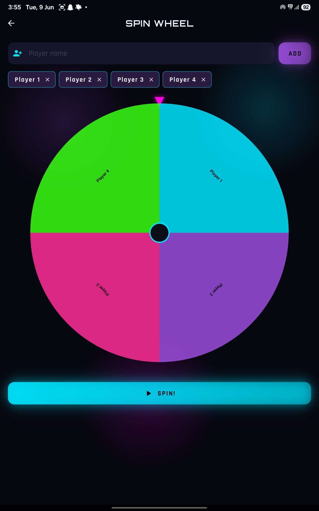
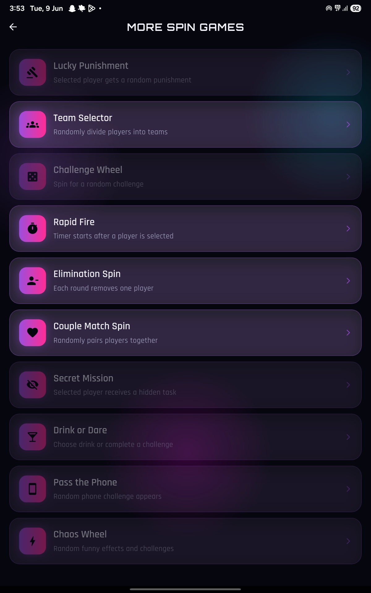
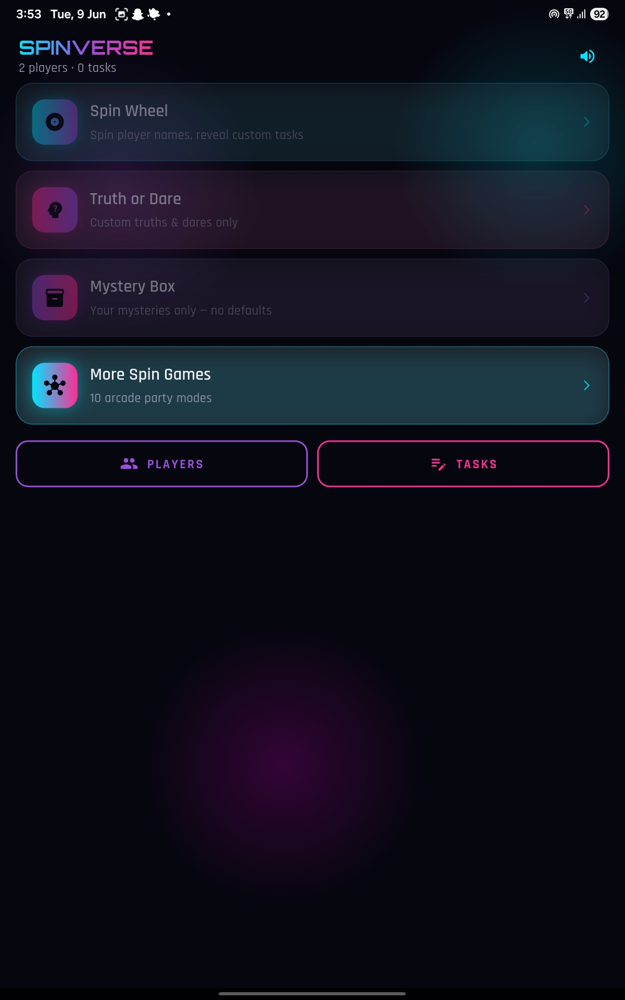
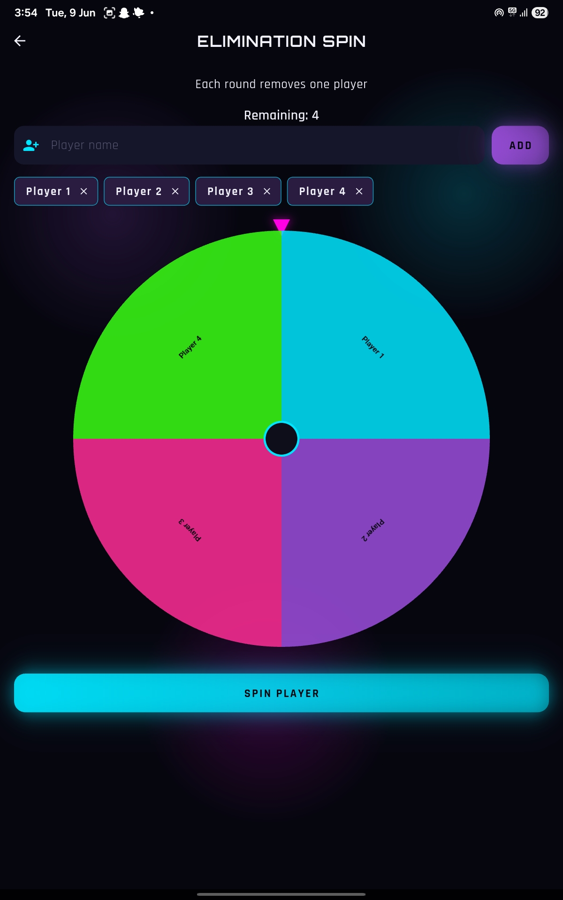
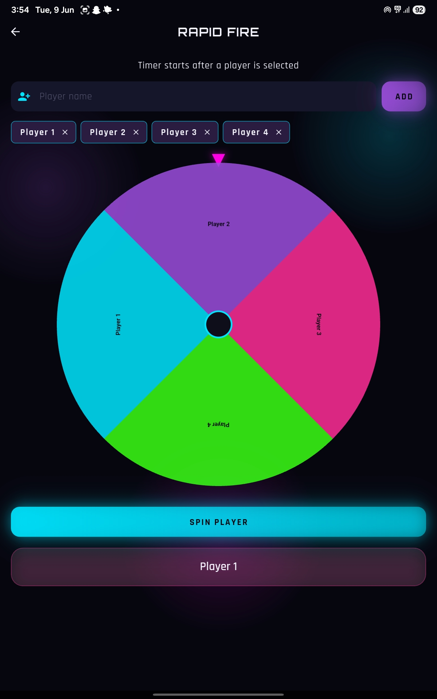
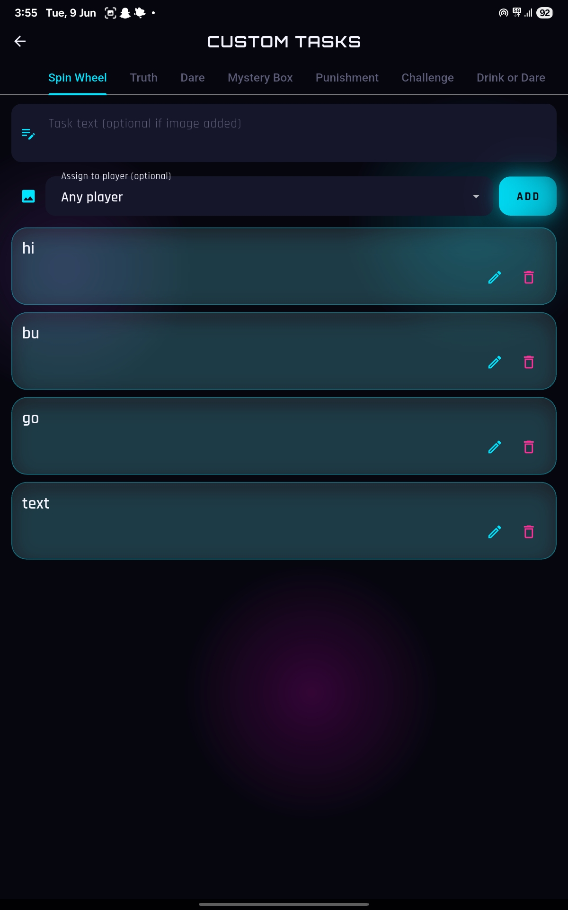

# SPINVERSE 🎡

SPINVERSE is an all-in-one party game application designed to make gatherings more fun, interactive, and unpredictable. Featuring multiple spin-based game modes, challenges, dares, and random selection tools, SPINVERSE is perfect for friends, couples, family events, parties, and social gatherings.

---

## 📱 Features

### 🎡 Spin Wheel

A customizable spinning wheel that randomly selects outcomes.

### 🤔 Truth or Dare

Classic Truth or Dare mode with hundreds of fun questions and dares.

### 🎁 Mystery Box

Open mystery boxes and discover random surprises, challenges, or rewards.

### 👥 Team Selector

Quickly divide players into balanced teams.

### ⚡ Rapid Fire

Fast-paced challenge mode with quick questions and tasks.

### ❌ Elimination Spin

Randomly eliminate players until a winner remains.

### 💕 Couple Match Spin

Fun game mode designed for couples and friends.

### 🕵️ Secret Mission

Assign secret tasks to players without revealing them to others.

### 🍹 Drink or Dare

Choose between completing a dare or taking a drink.

### 📱 Pass The Phone

Interactive prompts that require players to pass the phone around.

### 🌪️ Chaos Wheel

Unexpected twists and random challenges.

### 💪 Challenge Wheel

Skill-based and fun challenges for individuals or groups.

### 🎯 Lucky Punishment

Random punishments and hilarious consequences.

---

## 🖼️ Screenshots

  
  
  

  
  
  

  
  
  

  

---

## 🚀 Installation

1. Download the latest APK from the Releases section.
2. Transfer the APK to your Android device.
3. Enable installation from unknown sources if required.
4. Install and launch SPINVERSE.

---

## 🎮 How To Play

1. Open SPINVERSE.
2. Select your preferred game mode.
3. Add players if required.
4. Spin the wheel or start the activity.
5. Follow the selected challenge, dare, task, or result.
6. Enjoy with friends and family.

---

## 🎯 Ideal For

* House Parties
* Family Gatherings
* College Events
* Game Nights
* Couple Activities
* Friend Meetups
* Team Building Activities
* Road Trips

---

## 📌 Project Information

**Project Name:** SPINVERSE

**Category:** Party Game / Entertainment

**Platform:** Android

**Version:** 1.0

---

## 🛠️ Built With

* Android Development
* Claude AI Assisted Development

---

## 🤝 Contributing

Contributions, suggestions, and improvements are welcome.

1. Fork the repository.
2. Create a new branch.
3. Make your changes.
4. Submit a pull request.

---

## ⭐ Support

If you enjoy this project, consider giving it a star on GitHub.

---

## 📄 License

This project is released under the MIT License.
